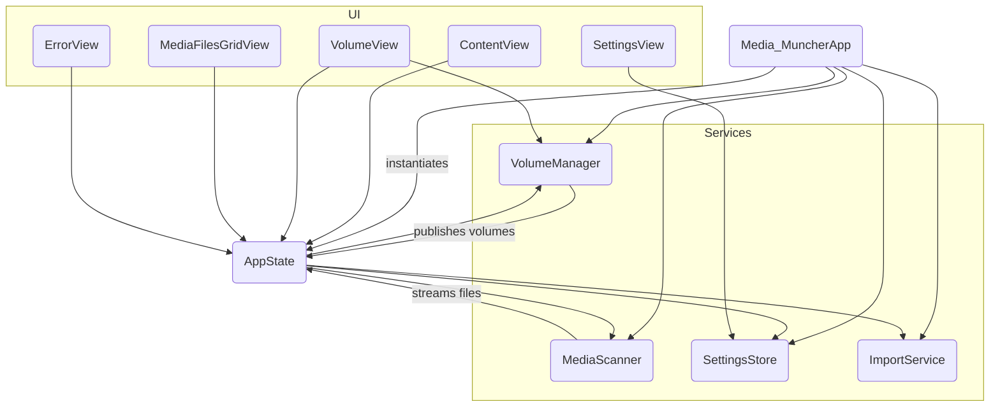
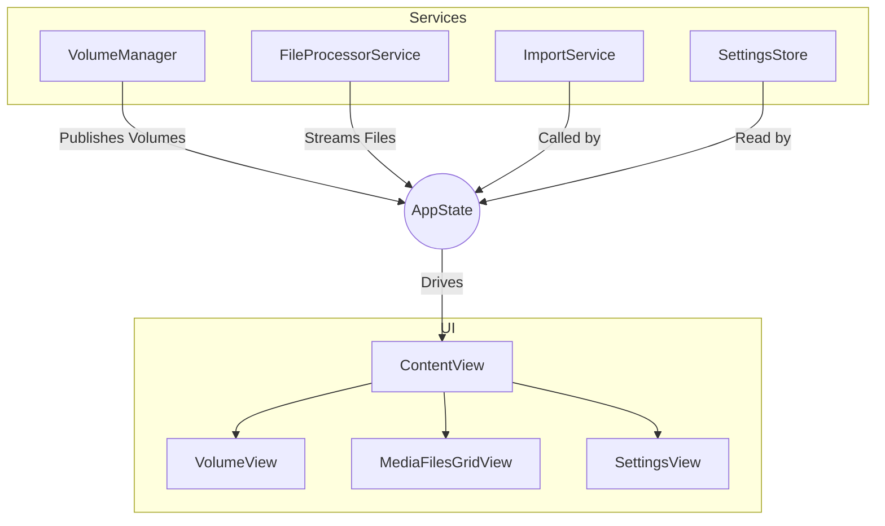

# Media Muncher – Architecture Guide

> **Purpose** – This document explains how the application is structured **today**. It doubles as a contributor guide: follow the conventions here when adding new functionality.

---
## 1. High-Level Overview

```
┌───────────────┐        insert/eject       ┌────────────────────┐
│ macOS System  │ ───────────────────────▶ │  VolumeManager     │
└───────────────┘  NSWorkspace events      │ (Service)          │
                                           └────────┬───────────┘
┌───────────────┐ scan files                        │ volumes
│  SwiftUI View │ ◀──────────────────────────────┐  │
└───────────────┘                                 │  │
      ▲                                           ▼  │
      │ UI Events, Data Binding              ┌───────────────┐
      └─────────────────────────────────────▶│   AppState    │
                                             │ (Orchestrator)│
                                             └───────┬───────┘
                                                     │
               ┌────────────────┐ scan(volume)       │
               │ MediaScanner   ├────────────────────┘
               │ (Service Actor)│◀───────────────────┐
               └────────────────┘ files, progress    │
                                             ┌───────────────┐
                                             │ ImportService │
                                             │  (Service)    │
                                             └───────────────┘
```

* The **SwiftUI layer** presents a sidebar of volumes, a grid of media files, and a settings panel. It binds to data published by the `AppState` and individual services.
* **Services** (`VolumeManager`, `MediaScanner`, `SettingsStore`, `ImportService`) are focused classes/actors responsible for a single domain. They own their data and expose it via Combine publishers or async streams.
* **`AppState`** is a singleton `ObservableObject` that acts as an **Orchestrator** or **Facade**. It wires together the services and the UI, but contains very little logic itself.
* **Models** (`Volume`, `File`, `AppError`) are simple value types passed between layers.
* All file-system work is done asynchronously so the UI never blocks.

---
## 2. Source-Code Map (current)

| File | Responsibility | Key Types / Functions |
|------|----------------|------------------------|
| **Media_MuncherApp.swift** | App entry point, service instantiation | `Media_MuncherApp` |
| **AppState.swift** | Orchestrates services and exposes unified state to the UI. | `AppState` |
| **Services/VolumeManager.swift** | Discovers, monitors, and ejects removable volumes. | `VolumeManager`|
| **Services/MediaScanner.swift** | Scans a volume for media files on a background thread, maintains an in-actor **LRU thumbnail cache (2 000 entries)**, and detects pre-existing files in the destination (now considers relative `YYYY/MM` sub-folders + rename-template). | `MediaScanner` |
| **Services/SettingsStore.swift**| Persists user settings via `UserDefaults`. | `SettingsStore` |
| **Services/ImportService.swift**| Copies files to the destination using security-scoped bookmarks. Delegates all path calculation to `DestinationPathBuilder`. | `ImportService` |
| **Helpers/DestinationPathBuilder.swift** | Pure helper providing `relativePath(for:organizeByDate:renameByDate:)` and `buildFinalDestinationUrl(...)`; used by both **MediaScanner** and **ImportService** to eliminate duplicated path-building logic and handle filename collisions. | `DestinationPathBuilder` |
| **Models/VolumeModel.swift** | Immutable record for a removable drive | `Volume` |
| **Models/FileModel.swift** | Immutable record for a media file & helpers | `File`, `MediaType`, `FileStatus`, `MediaType.from(filePath:)` |
| **Models/AppError.swift**| Domain-specific error types. | `AppError` |
| **VolumeView.swift** | Sidebar showing all volumes, eject button. Binds to `VolumeManager`. | `VolumeView` |
| **MediaView.swift** | Decides what to show in detail pane. Binds to `AppState`. | `MediaView` |
| **MediaFilesGridView.swift** | Adaptive grid of media icons/filenames. Binds to `AppState`. | `MediaFilesGridView` |
| **SettingsView.swift** | Toggles & folder picker. Binds to `SettingsStore`. | `SettingsView`, `FolderPickerView` |
| **ErrorView.swift** | Inline error banner. Binds to `AppState`. | `ErrorView` |
| **ContentView.swift** | Arranges split-view, toolbar, Import button. | `ContentView` |
| Tests folders | Unit tests for services and helpers. | `MediaScannerTests`, `ImportServiceTests`, etc. |

> **Observation** – The previous monolithic `AppState` has been refactored into focused services, improving separation of concerns.

---
## 3. Runtime Flow (today)
1. `Media_MuncherApp` instantiates `VolumeManager`, `MediaScanner`, `SettingsStore`, `ImportService` and `AppState`. It injects them as `@EnvironmentObject`s.
2. `VolumeManager` uses `NSWorkspace` to discover and publish an array of `Volume`s.
3. `AppState` subscribes to `VolumeManager`'s volumes and automatically selects the first one.
4. The volume selection change is published by `AppState`.
5. On observing the change, `AppState` asks the `MediaScanner` actor to begin scanning the selected volume.
6. `MediaScanner` traverses the volume on a background task, batching results and progress into `AsyncStream`s.
7. `AppState` collects these stream results and updates its `@Published` `files` and `filesScanned` properties on the **MainActor**.
8. `MediaFilesGridView` and `ContentView` observe `AppState` and display the new files and progress as they arrive.
9. When **Import** is clicked, `AppState` calls the `ImportService` to copy the scanned files to the destination set in `SettingsStore`.

---
## 4. Planned Modularisation (to-be)

> This plan has now been implemented. The sections above reflect the new service-based architecture.

| Module | Responsibility | Notes |
|--------|----------------|-------|
| `VolumeManager` | Discover, eject & monitor volumes, expose `Publisher<[Volume]>` | Wrap `NSWorkspace` & external devices (future PTP/MTP). |
| `MediaScanner` | **Phase 1:** fast filesystem walk that emits basic `File` structs (path, name, size) immediately; **Phase 2:** schedules asynchronous enrichment tasks that add heavy metadata (EXIF, thumbnails) without blocking the UI | Move initial `enumerateFiles()` here and spin-off a `MetadataEnricher` actor (or background `Task`) for phase 2. |
| `ImportService` | Copy files, handle duplicates & deletions **and pre-calculate the aggregate byte total of an import queue to enable accurate progress reporting** | Detached actor handling concurrency & error isolation. **Handles file naming in a two-phase process: first it generates ideal destination paths based on templates; second it resolves any name collisions within that list before any copy operations begin.** |
| `SettingsStore` | Type-safe wrapper around `UserDefaults` & security bookmarks | Provides Combine `@Published` properties. |
| `Logger` | Structured logging (os
data, rotating file handler) | Respect user privacy; in dev builds default to `stdout`. |
| `AppState` | Pure composition root that orchestrates above services | Slimmed down, no heavy logic. |

### Dependency Flow (to-be)
`SwiftUI View → AppState (Facade) → Services (actors) → Foundation / OS`  
No service depends back on SwiftUI, keeping layers clean.

---
## 5. Concurrency Model
* **Actors** – `MediaScanner` & `ImportService`
* **MainActor** – Only UI changes run here; services stay off the main thread.
* **Task Cancellation** – Long-running scans / imports call `Task.checkCancellation()` each iteration.

---
## 6. Error Handling Strategy
* Domain-specific `enum AppError : Error` with associated values for context.
* Services throw typed errors; `AppState` converts them into user-facing banners or alerts.
* Never crash on disk-I/O error – report & allow the user to retry.

---
## 7. Persistence & Idempotency
* Destination file uniqueness is guaranteed by capture-date + file-size; no hashes / no DB.
* The **filesystem is the single source of truth**. Import operations always recompute the expected destination path; if a file already exists it is skipped.
* User settings are stored in `UserDefaults` (some as security-scoped bookmarks).

---
## 8. Security & Sandboxing
* Entitlements: `com.apple.security.device.usb`, `com.apple.security.files.user-selected.read-write`, `com.apple.security.files.removable`.
* Destination folder persisted as a security-scoped bookmark so user grants access once.
* No plain file paths are stored outside the sandbox container.

---
## 9. Testing Strategy
* **Unit Tests** for helpers & services (mocking `FileManager`, `NSWorkspace`).
* **Integration Tests** mount a DMG volume fixture with synthetic media.
* UI tests & CI have been removed temporarily and will return when the UI stabilises.

---
## 10. Code Style & Contribution Guidelines
1. **Formatting** – `swiftformat` with repo-pinned rules.
2. **Naming** – Apple conventions; acronyms upper-cased (`UUID`, `URL`).
3. **Docs** – Every public symbol must have a Markdown doc comment.
4. **Commits** – Conventional Commits prefixed with PRD story ID.
5. **Branches** – `main`, `feature/<story-id>`, `bugfix/<issue>`, `release/*`.
6. **Pull Requests** – Must pass unit tests (`xcodebuild test`) and review; include before/after screenshots for UI.
7. **Feature Flags** – Use `#if DEBUG` or `UserDefaults` keys.

---
## 11. Build & Run (developers)
```bash
# prereqs
xcode-select --install  # command-line tools
brew install swiftformat swiftlint

open "Media Muncher.xcodeproj"
```
* Deployment target macOS 13+.
* Run the **Media Muncher** scheme; press ⌘U for tests.

---
## 12. Frequently Asked Questions
**Q:** Why not just use Photos.app import?  
**A:** Media Muncher offers a custom folder hierarchy, no proprietary library, automation hooks, and supports professional RAW/video formats that Photos ignores.

---
## 13. File Interaction Diagram


---
## 14. Recent Maintenance (2025-06-24)
* **ALT-1** – Introduced `DestinationPathBuilder` helper; `ImportService` & `MediaScanner` now delegate path logic → single source of truth.
* Purged all Automation/LaunchAgent code (Epic-7 reset).
* Added LRU thumbnail cache (2 000 entries) into `MediaScanner` actor.

The application follows a modern MVVM-inspired architecture, tailored for SwiftUI. The core components are:

- **Views**: Pure SwiftUI views responsible for rendering the UI.
- **AppState**: The central nervous system of the app. It acts as a ViewModel for the entire application, holding all the state and orchestrating the services.
- **Services**: Asynchronous actors or classes responsible for specific domains of business logic (e.g., managing volumes, processing files).
- **Models**: Simple data-holding structures.



### Core Components

#### AppState

The `AppState` is a global `ObservableObject` that holds the application's state. It is the single source of truth for the UI. It owns and orchestrates all the services.

#### File Processor Service

The `FileProcessorService` is a stateless actor responsible for all logic related to analyzing files on the source media. It performs a two-stage process:

1.  **Fast Enumeration**: A quick pass over the source directory to identify all valid media files and return a list of placeholder `File` objects. This allows the UI to populate instantly.
2.  **File Processing**: A more intensive, asynchronous operation that takes a single `File` object and enriches it with:
    *   Metadata (EXIF date, size)
    *   A thumbnail image
    *   Its final, collision-resolved destination path.
    *   Its status (`pre_existing`, `duplicate_in_source`, etc.)

This service contains the complex logic for both source-to-source duplicate detection and destination collision resolution.

#### Import Service

The `ImportService` is an actor that handles the actual file copy operations from the source to the destination. It has been refactored to be fully transactional and resilient.

It exposes a single function, `importFiles(...)`, which takes the list of files to import and returns an `AsyncThrowingStream<File, Error>`. As the service processes each file, it `yield`s updated `File` objects back to the caller, allowing for real-time UI updates.

The import process for each file is:
1.  **Copy**: The file is copied to its final destination. The service yields a `File` with status `.copying`.
2.  **Verify**: After a successful copy, the service verifies that the destination file's size matches the source file's size. The service yields a `File` with status `.verifying`.
3.  **Finalize**: If verification passes, the service yields the final `File` with status `.imported`. If the user has enabled it, the source file is deleted.

If any step fails, the service yields a `File` with status `.failed` and an `importError` message, then continues processing the next file in the queue. This ensures that a single failure does not halt the entire import batch.

### Data Flow for a Scan

1.  **User selects a volume.**
2.  `AppState` initiates a scan by calling `FileProcessorService.fastEnumerate()`.
3.  The service returns a complete list of placeholder `File` models, which `AppState` publishes. The UI immediately updates to show the grid of files (without thumbnails).
4.  `AppState` starts a background task that iterates through the list of files. For each file, it calls `FileProcessorService.processFile()`.
5.  As each file is processed, the service returns the fully enriched `File` model.
6.  `AppState` finds the corresponding file in its main array and updates it.
7.  Because the `files` array is `@Published` and `File` is a struct, the UI is notified of the change, and the specific icon for the processed file is updated with its thumbnail and status overlay.
8.  This continues until all files have been processed.