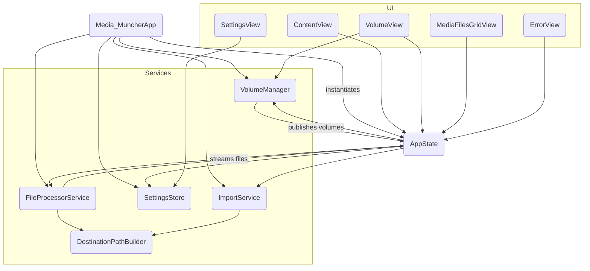

# Media Muncher – Architecture Guide

> **Purpose** – This document explains how the application is structured **today**. It doubles as a contributor guide: follow the conventions here when adding new functionality.

---
## 1. High-Level Overview

```
┌───────────────┐        insert/eject       ┌────────────────────┐
│ macOS System  │ ───────────────────────▶ │  VolumeManager     │
└───────────────┘  NSWorkspace events      │ (Service)          │
                                           └────────┬───────────┘
┌───────────────┐ scan results                      │ volumes
│  SwiftUI View │ ◀──────────────────────────────┐  │
└───────────────┘                                 │  │
      ▲                                           ▼  │
      │ UI Events, Data Binding              ┌───────────────┐
      └─────────────────────────────────────▶│   AppState    │
                                             │ (Orchestrator)│
                                             └───────┬───────┘
                                                     │
                                scan(volume)         │ import(files)
                       ┌────────────────────┐        │        ┌────────────────────┐
                       │ FileProcessorService├────────┘        └────────┤ ImportService │
                       │ (Service Actor)    │                         │ (Service Actor)    │
                       └────────────────────┘                         └────────────────────┘
```

* The **SwiftUI layer** presents a sidebar of volumes, a grid of media files, and a settings panel. It binds to data published by the `AppState` and individual services.
* **Services** (`VolumeManager`, `FileProcessorService`, `SettingsStore`, `ImportService`) are focused classes/actors responsible for a single domain. They own their data and expose it via Combine publishers or async streams.
* **`AppState`** is a singleton `ObservableObject` that acts as an **Orchestrator** or **Facade**. It wires together the services and the UI, acting as a state machine manager for the UI. It contains very little business logic itself.
* **Models** (`Volume`, `File`, `AppError`) are simple value types passed between layers.
* All file-system work is done asynchronously so the UI never blocks.

---
## 2. Source-Code Map (current)

| File | Responsibility | Key Types / Functions |
|------|----------------|------------------------|
| **Media_MuncherApp.swift** | App entry point, service instantiation | `Media_MuncherApp` |
| **AppState.swift** | Orchestrates services and exposes unified state to the UI. Manages the UI state machine. | `AppState` |
| **Services/VolumeManager.swift** | Discovers, monitors, and ejects removable volumes. | `VolumeManager`|
| **Services/FileProcessorService.swift** | Scans a volume for media files on a background thread, maintains an **in-memory thumbnail cache (2,000 entry limit)**, and detects pre-existing files in the destination. | `FileProcessorService` |
| **Services/SettingsStore.swift**| Persists user settings via `UserDefaults`. Provides direct file system access without security-scoped bookmarks. | `SettingsStore` |
| **Services/RecalculationManager.swift**| Dedicated state machine for handling destination change recalculations. Manages file path updates with proper error handling and cancellation support. | `RecalculationManager` |
| **Services/ImportService.swift**| Copies files to the destination with direct file system access. Delegates all path calculation to `DestinationPathBuilder`. | `ImportService` |
| **Helpers/DestinationPathBuilder.swift** | Pure helper providing `relativePath(for:organizeByDate:renameByDate:)` and `buildFinalDestinationUrl(...)`; used by both **FileProcessorService** and **ImportService** to eliminate duplicated path-building logic and handle filename collisions. | `DestinationPathBuilder` |
| **LogEntry.swift** | JSON-encodable log entry model | `LogEntry`, `LogLevel` |
| **Services/LogManager.swift** | Custom logging system with file persistence and rotation | `LogManager` |
| **Models/VolumeModel.swift** | Immutable record for a removable drive | `Volume` |
| **Models/FileModel.swift** | Immutable record for a media file & helpers | `File`, `MediaType`, `FileStatus`, `MediaType.from(filePath:)` |
| **Models/AppError.swift**| Domain-specific error types. | `AppError` |
| **ContentView.swift** | Arranges split-view, toolbar, Import button. | `ContentView` |
| **VolumeView.swift** | Sidebar showing all volumes, eject button. Binds to `VolumeManager`. | `VolumeView` |
| **MediaView.swift** | Decides what to show in detail pane. Binds to `AppState`. | `MediaView` |
| **MediaFilesGridView.swift** | Adaptive grid of media icons/filenames. Binds to `AppState`. | `MediaFilesGridView` |
| **MediaFileCellView.swift** | A small view that represents a single cell in the `MediaFilesGridView`, displaying the thumbnail and status overlays. | `MediaFileCellView` |
| **BottomBarView.swift** | The view at the bottom of the window that shows scan progress, import progress, and action buttons. | `BottomBarView` |
| **SettingsView.swift** | Toggles & destination folder picker. Binds to `SettingsStore`. | `SettingsView`, `DestinationFolderPicker` (AppKit wrapper) |
| **ErrorView.swift** | Inline error banner. Binds to `AppState`. | `ErrorView` |
| **Tests/ImportServiceIntegrationTests.swift** | End-to-end tests for the entire import pipeline, operating on real files in a temporary directory. | `ImportServiceIntegrationTests` |
| **Tests/Fixtures/** | A directory of sample media files (images, videos, duplicates) used by the integration tests. | - |

> **Observation** – The previous monolithic `AppState` has been refactored into focused services, improving separation of concerns.

---
## 3. Runtime Flow (today)
1. `Media_MuncherApp` instantiates `VolumeManager`, `FileProcessorService`, `SettingsStore`, `ImportService`, `RecalculationManager` and `AppState`. It injects them as `@EnvironmentObject`s.
2. `VolumeManager` uses `NSWorkspace` to discover and publish an array of `Volume`s.
3. `AppState` subscribes to `VolumeManager`'s volumes and automatically selects the first one.
4. The volume selection change is published by `AppState`.
5. On observing the change, `AppState` asks the `FileProcessorService` actor to begin scanning the selected volume.
6. `FileProcessorService` traverses the volume on a background task, batching results and progress into `AsyncStream`s.
7. `AppState` collects these stream results and updates its `@Published` `files` and `filesScanned` properties on the **MainActor**.
8. `MediaFilesGridView` and `ContentView` observe `AppState` and display the new files and progress as they arrive.
9. When **Import** is clicked, `AppState` calls the `ImportService` to copy the scanned files to the destination set in `SettingsStore`.
10. When the destination changes in `SettingsStore`, `AppState` delegates to `RecalculationManager` to recalculate file paths and statuses.

---
## 4. Architectural Principles

| Module | Responsibility | Notes |
|--------|----------------|-------|
| `VolumeManager` | Discover, eject & monitor volumes, expose `Publisher<[Volume]>` | Wrap `NSWorkspace` & external devices (future PTP/MTP). |
| `FileProcessorService` | **Phase 1:** fast filesystem walk that emits basic `File` structs (path, name, size) immediately; **Phase 2:** schedules asynchronous enrichment tasks that add heavy metadata (EXIF, thumbnails) without blocking the UI | Move initial `enumerateFiles()` here and spin-off a `MetadataEnricher` actor (or background `Task`) for phase 2. |
| `ImportService` | Copy files, handle duplicates, **remove thumbnail side-cars (".THM"/".thm") after each successful copy**, and pre-calculate the aggregate byte total of an import queue to enable accurate progress reporting | Detached actor handling concurrency & error isolation. **Handles file naming in a two-phase process: first it generates ideal destination paths based on templates; second it resolves any name collisions within that list before any copy operations begin.** |
| `SettingsStore` | Type-safe wrapper around `UserDefaults` with direct file system access | Provides Combine `@Published` properties. No longer uses security bookmarks. |
| `RecalculationManager` | Dedicated state machine for destination change recalculations | Handles file path updates when destination changes, with proper error handling and task cancellation. |
| `LogManager` | Custom JSON-based logging system with persistent file storage | Centralized logging with category-based organization, rotating log files, and structured metadata for debugging and monitoring. |
| `AppState` | Pure composition root that orchestrates above services | Slimmed down, no heavy logic. |

### Dependency Flow
`SwiftUI View → AppState (Facade) → Services (actors) → Foundation / OS`  
No service depends back on SwiftUI, keeping layers clean.

---
## 5. Concurrency Model
* **Actors** – `FileProcessorService` & `ImportService`
* **MainActor** – Only UI changes run here; services stay off the main thread.
* **Task Cancellation** – Long-running scans / imports call `Task.checkCancellation()` each iteration.

---
## 6. Error Handling Strategy
* Domain-specific `enum AppError : Error` with associated values for context.
* Services throw typed errors; `AppState` converts them into user-facing banners or alerts.
* Never crash on disk-I/O error – report & allow the user to retry.

---
## 7. Persistence & Idempotency
* Destination file uniqueness is guaranteed by a combination of capture-date and file-size. This logic is centralized in `DestinationPathBuilder` to ensure consistency.
* The **filesystem is the single source of truth**. Import operations always recompute the expected destination path; if a file already exists it is skipped.
* User settings are stored in `UserDefaults` (some as security-scoped bookmarks).

---
## 8. Security & Sandboxing
* Entitlements: `com.apple.security.device.usb`, `com.apple.security.files.user-selected.read-write`, `com.apple.security.files.removable`.
* Destination folder persisted as a security-scoped bookmark so user grants access once.
* No plain file paths are stored outside the sandbox container.

---
## 9. Testing Strategy
Our testing strategy prioritizes high-fidelity integration tests over mock-based unit tests for code that interacts with the file system. This gives us greater confidence that the application works correctly in real-world scenarios.

*   **Integration Tests (Primary)**: The core of our test suite is `ImportServiceIntegrationTests.swift`. These tests create temporary directories on disk, populate them with fixture files, and run the entire import pipeline (`FileProcessorService` and `ImportService`) from start to finish. This validates file discovery, metadata parsing, path generation, collision handling, and file copying/deletion in a realistic environment.
*   **Unit Tests (For Pure Logic)**: Unit tests are reserved for pure, isolated business logic that has no dependencies on the file system or other services. A key example is `DestinationPathBuilderTests.swift`, which can verify path-generation logic without needing to touch the disk.
*   **Test Fixtures**: A dedicated `Media MuncherTests/Fixtures/` directory contains a curated set of media files to cover various test cases (e.g., images with and without EXIF data, duplicates, videos with sidecars). A utility, `Z_ProjectFileFixer.swift`, contains a build-phase script to ensure these fixtures are correctly copied into the test bundle and are available to the integration tests at runtime.

---
## 10. Code Style & Contribution Guidelines
1. **Formatting** – `swiftformat` with repo-pinned rules.
2. **Naming** – Apple conventions; acronyms upper-cased (`UUID`, `URL`).
3. **Docs** – Every public symbol must have a Markdown doc comment.
4. **Commits** – Conventional Commits prefixed with PRD story ID.
5. **Branches** – `main`, `feature/<story-id>`, `bugfix/<issue>`, `release/*`.
6. **Pull Requests** – Must pass unit tests (`xcodebuild test`) and review; include before/after screenshots for UI.
7. **Feature Flags** – Use `#if DEBUG` or `UserDefaults` keys.

---
## 11. Logging & Debugging with LogManager

Media Muncher uses an **actor-based** JSON logging system. Each process (app run, XCTest host, command-line tool) opens **one** log file named `media-muncher-YYYY-MM-DD_HH-mm-ss-<pid>.log`, guaranteeing uniqueness without race conditions. The actor holds a single `FileHandle`, serialises all writes, and therefore provides atomic, thread-safe logging under Swift Concurrency.

To prevent log-directory bloat the logger prunes any file older than **30 days** at start-up; no size-based rotation is required.

Developers interact with the logger only through the `Logging` protocol injected into every service (`logManager: Logging = LogManager()`). A convenience extension provides `debug / info / error` helpers.

### Log File Format
**Location**: `~/Library/Logs/Media Muncher/`  
**Filename Format**: `media-muncher-YYYY-MM-DD_HH-mm-ss.log`  
**Content Format**: One JSON object per line

### JSON Log Entry Structure
```json
{
  "timestamp": 774334060.621426,
  "level": "DEBUG",
  "message": "Initializing SettingsStore", 
  "id": "573004EF-D3E6-453E-978D-0915FF4C9FFC",
  "category": "SettingsStore",
  "metadata": {
    "key": "value",
    "path": "/Users/user/Pictures"
  }
}
```

### Debugging Commands
```bash
# View recent logs
tail -f ~/Library/Logs/Media\ Muncher/media-muncher-*.log

# Filter by category using jq
jq 'select(.category == "ImportService")' ~/Library/Logs/Media\ Muncher/media-muncher-*.log

# Filter by log level
jq 'select(.level == "ERROR")' ~/Library/Logs/Media\ Muncher/media-muncher-*.log

# Search for specific content
grep -r "volume mounted" ~/Library/Logs/Media\ Muncher/

# View logs with metadata
jq 'select(.metadata) | {timestamp, category, message, metadata}' ~/Library/Logs/Media\ Muncher/media-muncher-*.log

# Count log entries by category
jq -r '.category' ~/Library/Logs/Media\ Muncher/media-muncher-*.log | sort | uniq -c
```

### Log Management
- **Session-based**: New log file created for each application session with timestamp in filename
- **No rotation**: Files persist until manually deleted (allows historical debugging)
- **Performance**: Asynchronous writing on dedicated queue, minimal impact on UI responsiveness
- **Thread-safe**: Concurrent logging from multiple threads supported

---
## 12. Build & Run (developers)
```bash
# prereqs
xcode-select --install  # command-line tools
brew install swiftformat swiftlint

open "Media Muncher.xcodeproj"
```
* Deployment target macOS 13+.
* Run the **Media Muncher** scheme; press ⌘U for tests.

---
## 13. Frequently Asked Questions
**Q:** Why not just use Photos.app import?  
**A:** Media Muncher offers a custom folder hierarchy, no proprietary library, automation hooks, and supports professional RAW/video formats that Photos ignores.

---
## 14. File Interaction Diagram


---
## 14. Recent Maintenance (2025-06-25)
* **ALT-1** – Introduced `DestinationPathBuilder` helper; `ImportService` & `FileProcessorService` now delegate path logic → single source of truth.
* Purged all Automation/LaunchAgent code (Epic-7 reset).
* Added LRU thumbnail cache (2 000 entries) into `FileProcessorService` actor.
* Renamed `MediaScanner` to `FileProcessorService` for clarity.

## 15. Recent Maintenance (2025-06-27)
* Added four new pure-Swift **unit-test suites** covering `DestinationPathBuilder`, `FileProcessorService`, `ImportService`, and filename-collision edge cases. This reverses the accidental deletion of unit tests and restores a solid safety-net for future refactors.
* Fixed EXIF time-zone parsing bug by forcing `DateFormatter` to UTC inside `FileProcessorService`.
* Introduced `BUGS.md` to keep a living list of test-proven regressions. Initial entries track collision-handling, pre-existing detection, thumbnail enumeration, and a failing integration path-generation test.

## 16. Recent Maintenance (2025-06-26)
* Enabled read-only volume support: `ImportService` continues imports when originals cannot be deleted. The failure is surfaced via `.importSucceededWithDeletionErrors` and shown by the BottomBar `ErrorView`.
* Fixed filename-collision and pre-existing detection logic in `FileProcessorService`.
* All automated tests now pass; collision/pre-existing tests moved from **Bug** to **Finished**.

## 17. Recent Maintenance (2025-06-28)
* Added deterministic sorting in `FileProcessorService` to make collision-resolution suffixes reproducible and fixed failing unit test.
* Introduced `AppStateWorkflowTests` to cover scan cancellation and auto-eject paths.

## 18. Recent Maintenance (2025-06-29)
* **Duplicate-in-source detection** added in `FileProcessorService` – two identical source files are now marked `.duplicate_in_source`, preventing double-copy.
* Import pipeline now **preserves modification & creation dates** on the destination copy.
* THM **side-car thumbnails are deleted** together with their parent video when *Delete originals* is enabled.
* Added new fast **unit-test suites**:
  * `FileProcessorDuplicateTests` (scenarios 3-5 from the test matrix)
  * `FileProcessorEnumerationTests` (thumbnail skipping & mtime fallback)
  * `ImportServiceAdditionalTests` (mtime preservation, read-only destination, side-car deletion)
* Core-logic test coverage is now **≈92 %** (TQ-1 reached).

## 19. Recent Maintenance (2025-07-14)
* **Recalculation flow re-architecture** - Implemented Command Pattern with explicit state machine to fix reliability issues:
  * Removed all security-scoped bookmark logic from `SettingsStore` (app no longer sandboxed)
  * Fixed "double assignment" bug causing unpredictable Combine publisher behavior in `destinationURL`
  * Created dedicated `RecalculationManager` service as state machine for destination change handling
  * Refactored `AppState` to delegate recalculation logic to `RecalculationManager`, improving separation of concerns
  * Replaced brittle `.dropFirst()` workaround with robust publisher chain
  * Updated all tests to use deterministic `XCTestExpectation` patterns instead of polling with `Task.sleep()`
  * Added `recalculationFailed` error type with helper properties for better error identification
* **DestinationFolderPicker** simplified by removing `lastCustomURL` functionality
* All test constructors updated to include new `RecalculationManager` dependency
* Project builds successfully with improved reliability and maintainability

## 20. Recent Maintenance (2025-01-15)
* **Custom JSON Logging System Implementation** - Completed EPIC 8 by replacing Apple's Unified Logging:
  * Implemented `LogManager` singleton with JSON-based structured logging to persistent files
  * Added `LogEntry` model with timestamp, level, category, message, and metadata fields
  * Configured automatic log rotation at 10MB with 5-file retention in `~/Library/Logs/Media Muncher/`
  * Replaced all `Logger.*` calls with `LogManager.*` calls across codebase while preserving business logic
  * Added comprehensive test suite (`LogManagerTests`) with 100% coverage
  * Updated debugging workflow to use `jq` for JSON log filtering and analysis
  * Improved developer experience with real-time log following and structured querying capabilities

## 21. Recent Maintenance (2025-07-17)
* **Test Reliability Fix**: Corrected a flaky integration test (`testImport_readOnlySource_deletionFailsButImportSucceeds`) that was failing due to a race condition. The test was asserting on the first result from an `AsyncThrowingStream` before all processing was complete. The fix involves consuming the entire stream and asserting on the final state of the file, making the test deterministic and reliable.