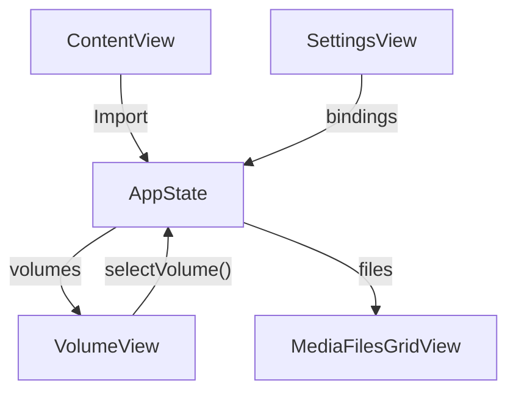

# Media Muncher – Architecture Guide

> **Purpose** – This document explains how the application is structured **today** and how we intend to evolve it. It doubles as a contributor guide: follow the conventions here when adding new functionality.

---
## 1. High-Level Overview

```
┌───────────────┐        insert/eject       ┌────────────────────┐
│ macOS System  │ ───────────────────────▶ │ VolumeManager      │
└───────────────┘  NSWorkspace events      │  (today: part of   │
                                            │   AppState)        │
┌───────────────┐ enumerate files          └────────┬───────────┘
│  SwiftUI View │ ◀──────────────────────────────┐  │ media batch
└───────────────┘                                 │  │
                                                  ▼  │ import
                                             ┌───────────────┐
                                             │ ImportEngine  │
                                             │  (STUB)       │
                                             └───────────────┘
```

* The **SwiftUI layer** presents a sidebar of volumes, a grid of media files, and a settings panel.
* **`AppState`** is a singleton `ObservableObject` injected into the environment. It currently performs _every_ non-UI responsibility (volume observation, scanning, settings persistence, import stub, error state).
* **Models** (`Volume`, `File`) are simple value types passed to the UI.
* All file-system work is done asynchronously so the UI never blocks.

---
## 2. Source-Code Map (current)

| File | Responsibility | Key Types / Functions |
|------|----------------|------------------------|
| **Media_MuncherApp.swift** | App entry point, dependency injection | `Media_MuncherApp` |
| **AppState.swift** | Global observable state **+** business logic (volume observers, enumeration, settings, error handling, import stub) | `AppState`, `programState`, `errorState` |
| **VolumeModel.swift** | Immutable record for a removable drive | `Volume` |
| **FileModel.swift** | Immutable record for a media file & helpers | `File`, `MediaType`, `FileStatus`, `determineMediaType()` |
| **VolumeView.swift** | Sidebar showing all volumes, eject button | `VolumeView` |
| **MediaView.swift** | Decides what to show in detail pane | `MediaView` |
| **MediaFilesGridView.swift** | Adaptive grid of media icons/filenames | `MediaFilesGridView` |
| **SettingsView.swift** | Toggles & folder picker backed by `UserDefaults` | `SettingsView`, `FolderPickerView` |
| **ErrorView.swift** | Inline error banner (non-writable dest folder) | `ErrorView` |
| **ContentView.swift** | Arranges split-view, toolbar, Import button | `ContentView` |
| Tests folders | Boiler-plate test targets | (empty) |

> **Observation** – `AppState` violates SRP; we will split it into services.

---
## 3. Runtime Flow (today)
1. `Media_MuncherApp` instantiates one `AppState` and injects it via `environmentObject`.
2. `AppState` sets up `NSWorkspace` observers which push `didMount` / `didUnmount` notifications.
3. `VolumeView` loads existing volumes and selects the first one; selection is bound back to `AppState.selectVolume()`.
4. On selection, `enumerateFiles()` traverses the volume on a background task, batches results, and appends to `files` on the **MainActor** so SwiftUI refreshes.
5. `MediaFilesGridView` displays new `File` items as they arrive.
6. When **Import** is clicked `importFiles()` runs – currently only a permission check.

---
## 4. Planned Modularisation (to-be)
| Module | Responsibility | Notes |
|--------|----------------|-------|
| `VolumeManager` | Discover, eject & monitor volumes, expose `Publisher<[Volume]>` | Wrap `NSWorkspace` & external devices (future PTP/MTP). |
| `MediaScanner` | Enumerate files, parse metadata, publish progress, cancellation token | Move `enumerateFiles()` here. |
| `ImportEngine` | Copy files, handle duplicates & deletions **and pre-calculate the aggregate byte total of an import queue to enable accurate progress reporting** | Detached actor handling concurrency & error isolation. **Handles file naming in a two-phase process: first it generates ideal destination paths based on templates; second it resolves any name collisions within that list before any copy operations begin.** |
| `SettingsStore` | Type-safe wrapper around `UserDefaults` & security bookmarks | Provides Combine `@Published` properties. |
| `Logger` | Structured logging (os
data, rotating file handler) | Respect user privacy; in dev builds default to `stdout`. |
| `AppState` | Pure composition root that orchestrates above services | Slimmed down, no heavy logic. |

### Dependency Flow (to-be)
`SwiftUI View → AppState (Facade) → Services (actors) → Foundation / OS`  
No service depends back on SwiftUI, keeping layers clean.

---
## 5. Concurrency Model
* **Actors** – `MediaScanner` & `ImportEngine` will be implemented as actors; they own mutable state and expose async APIs.
* **MainActor** – Only UI mutations or publishing `@Published` properties run on MainActor.
* **Task Cancellation** – Long-running scans or imports should accept `Task.checkCancellation()` each iteration.

---
## 6. Error Handling Strategy
* Domain-specific `enum AppError : Error` with associated values for context.
* Services throw typed errors; `AppState` translates them into simple UI‐level `errorState` or pushes a toast.
* Never crash on disk-I/O error – report & continue.

---
## 7. Persistence & Idempotency
* Destination file uniqueness is guaranteed by metadata such as capture date and size.
* The single source of truth is always the filesystem, mainly the destination folder. No other database or configuration is used. When importing files, source files are always projected to the destination folder for idempotency.

---
## 8. Security & Sandboxing
* Entitlements: `com.apple.security.device.usb`, `com.apple.security.files.user-selected.read-write`, `com.apple.security.files.removable`.
* Destination folder stored as **security-scoped bookmark** so the user grants access once.
* Never store plain file paths outside sandbox container.

---
## 9. Testing Strategy
* **Unit Tests** for utility functions and services (use protocol mocks for `FileManager`, `NSWorkspace`).
* **Integration Tests** mount a dmg volume fixture with synthetic media.
* **UI Tests** cover end-to-end import flow.
* CI: GitHub Actions workflow runs `xcodebuild test` on every PR.

---
## 10. Code Style & Contribution Guidelines

1. **Formatting** – Adopt [SwiftFormat](https://github.com/nicklockwood/SwiftFormat) with repository-pinned rules.
2. **Naming** – Apple API conventions; acronyms upper-cased (`UUID`, `URL`).
3. **Documentation** – Every public symbol must have a MarkDown doc comment.
4. **Commits** – Conventional Commits (`feat:`, `fix:`, `chore:`). Reference PRD user-story IDs.
5. **Branches** – `main` (protected), `feature/<story-id>`, `bugfix/<issue>`, `release/*`.
6. **Pull Requests** – Must pass CI and review; include before/after screenshots for UI.
7. **Feature Flags** – Use compile-time flags (`#if DEBUG`) or runtime `UserDefaults` keys for experimental work.

---
## 11. Build & Run (developers)
```bash
# prerequisites
xcode-select --install           # command-line tools
brew install swiftformat swiftlint

# open project
open "Media Muncher.xcodeproj"
```
* Target macOS 13+. Minimum deployment target is set in **Project ▸ Info**.
* Run the `Media Muncher` scheme; tests in `⌘U`.

---
## 12. Frequently Asked Questions
**Q:** Why not use Photos.app import?  
**A:** Media Muncher offers custom folder hierarchy, no proprietary library, automation hooks, and works with video and raw image formats unsupported by Photos.

---
## 13. File Interaction Diagram (today)


*(Update diagram when services are extracted.)* 