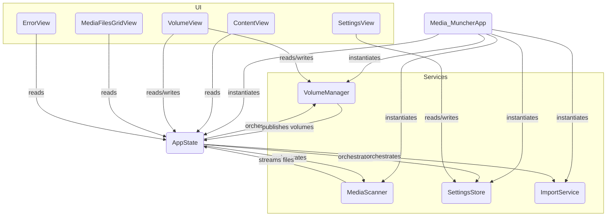

# Media Muncher – Architecture Guide

> **Purpose** – This document explains how the application is structured **today**. It doubles as a contributor guide: follow the conventions here when adding new functionality.

---
## 1. High-Level Overview

```
┌───────────────┐        insert/eject       ┌────────────────────┐
│ macOS System  │ ───────────────────────▶ │  VolumeManager     │
└───────────────┘  NSWorkspace events      │ (Service)          │
                                           └────────┬───────────┘
┌───────────────┐ scan files                        │ volumes
│  SwiftUI View │ ◀──────────────────────────────┐  │
└───────────────┘                                 │  │
      ▲                                           ▼  │
      │ UI Events, Data Binding              ┌───────────────┐
      └─────────────────────────────────────▶│   AppState    │
                                             │ (Orchestrator)│
                                             └───────┬───────┘
                                                     │
               ┌────────────────┐ scan(volume)       │
               │ MediaScanner   ├────────────────────┘
               │ (Service Actor)│◀───────────────────┐
               └────────────────┘ files, progress    │
                                             ┌───────────────┐
                                             │ ImportService │
                                             │  (Service)    │
                                             └───────────────┘
```

* The **SwiftUI layer** presents a sidebar of volumes, a grid of media files, and a settings panel. It binds to data published by the `AppState` and individual services.
* **Services** (`VolumeManager`, `MediaScanner`, `SettingsStore`, `ImportService`) are focused classes/actors responsible for a single domain. They own their data and expose it via Combine publishers or async streams.
* **`AppState`** is a singleton `ObservableObject` that acts as an **Orchestrator** or **Facade**. It wires together the services and the UI, but contains very little logic itself.
* **Models** (`Volume`, `File`, `AppError`) are simple value types passed between layers.
* All file-system work is done asynchronously so the UI never blocks.

---
## 2. Source-Code Map (current)

| File | Responsibility | Key Types / Functions |
|------|----------------|------------------------|
| **Media_MuncherApp.swift** | App entry point, service instantiation | `Media_MuncherApp` |
| **AppState.swift** | Orchestrates services and exposes unified state to the UI. | `AppState` |
| **Services/VolumeManager.swift** | Discovers, monitors, and ejects removable volumes. | `VolumeManager`|
| **Services/MediaScanner.swift** | Scans a volume for media files on a background thread, maintains an in-actor **LRU thumbnail cache (2 000 entries)**, and detects pre-existing files in the destination (now considers relative `YYYY/MM` sub-folders + rename-template). | `MediaScanner` |
| **Services/SettingsStore.swift**| Persists user settings via `UserDefaults`. | `SettingsStore` |
| **Services/ImportService.swift**| Copies files to the destination using security-scoped bookmarks. | `ImportService` |
| **Models/VolumeModel.swift** | Immutable record for a removable drive | `Volume` |
| **Models/FileModel.swift** | Immutable record for a media file & helpers | `File`, `MediaType`, `FileStatus`, `MediaType.from(filePath:)` |
| **Models/AppError.swift**| Domain-specific error types. | `AppError` |
| **VolumeView.swift** | Sidebar showing all volumes, eject button. Binds to `VolumeManager`. | `VolumeView` |
| **MediaView.swift** | Decides what to show in detail pane. Binds to `AppState`. | `MediaView` |
| **MediaFilesGridView.swift** | Adaptive grid of media icons/filenames. Binds to `AppState`. | `MediaFilesGridView` |
| **SettingsView.swift** | Toggles & folder picker. Binds to `SettingsStore`. | `SettingsView`, `FolderPickerView` |
| **ErrorView.swift** | Inline error banner. Binds to `AppState`. | `ErrorView` |
| **ContentView.swift** | Arranges split-view, toolbar, Import button. | `ContentView` |
| Tests folders | Unit tests for services and helpers. | `MediaScannerTests`, `ImportServiceTests`, etc. |

> **Observation** – The previous monolithic `AppState` has been refactored into focused services, improving separation of concerns.

---
## 3. Runtime Flow (today)
1. `Media_MuncherApp` instantiates `VolumeManager`, `MediaScanner`, `SettingsStore`, `ImportService` and `AppState`. It injects them as `@EnvironmentObject`s.
2. `VolumeManager` uses `NSWorkspace` to discover and publish an array of `Volume`s.
3. `AppState` subscribes to `VolumeManager`'s volumes and automatically selects the first one.
4. The volume selection change is published by `AppState`.
5. On observing the change, `AppState` asks the `MediaScanner` actor to begin scanning the selected volume.
6. `MediaScanner` traverses the volume on a background task, batching results and progress into `AsyncStream`s.
7. `AppState` collects these stream results and updates its `@Published` `files` and `filesScanned` properties on the **MainActor**.
8. `MediaFilesGridView` and `ContentView` observe `AppState` and display the new files and progress as they arrive.
9. When **Import** is clicked, `AppState` calls the `ImportService` to copy the scanned files to the destination set in `SettingsStore`.

---
## 4. Planned Modularisation (to-be)

> This plan has now been implemented. The sections above reflect the new service-based architecture.

| Module | Responsibility | Notes |
|--------|----------------|-------|
| `VolumeManager` | Discover, eject & monitor volumes, expose `Publisher<[Volume]>` | Wrap `NSWorkspace` & external devices (future PTP/MTP). |
| `MediaScanner` | **Phase 1:** fast filesystem walk that emits basic `File` structs (path, name, size) immediately; **Phase 2:** schedules asynchronous enrichment tasks that add heavy metadata (EXIF, thumbnails) without blocking the UI | Move initial `enumerateFiles()` here and spin-off a `MetadataEnricher` actor (or background `Task`) for phase 2. |
| `ImportService` | Copy files, handle duplicates & deletions **and pre-calculate the aggregate byte total of an import queue to enable accurate progress reporting** | Detached actor handling concurrency & error isolation. **Handles file naming in a two-phase process: first it generates ideal destination paths based on templates; second it resolves any name collisions within that list before any copy operations begin.** |
| `SettingsStore` | Type-safe wrapper around `UserDefaults` & security bookmarks | Provides Combine `@Published` properties. |
| `Logger` | Structured logging (os
data, rotating file handler) | Respect user privacy; in dev builds default to `stdout`. |
| `AppState` | Pure composition root that orchestrates above services | Slimmed down, no heavy logic. |

### Dependency Flow (to-be)
`SwiftUI View → AppState (Facade) → Services (actors) → Foundation / OS`  
No service depends back on SwiftUI, keeping layers clean.

---
## 5. Concurrency Model
* **Actors** – `MediaScanner` & `ImportService` will be implemented as actors; they own mutable state and expose async APIs.
* **MainActor** – Only UI mutations or publishing `@Published` properties run on MainActor.
* **Task Cancellation** – Long-running scans or imports should accept `Task.checkCancellation()` each iteration.

---
## 6. Error Handling Strategy
* Domain-specific `enum AppError : Error` with associated values for context.
* Services throw typed errors; `AppState` translates them into simple UI‐level `errorState` or pushes a toast.
* Never crash on disk-I/O error – report & continue.

---
## 7. Persistence & Idempotency
* Destination file uniqueness is guaranteed by metadata such as capture date and size.
* The single source of truth is always the filesystem, mainly the destination folder. No other database or configuration is used. When importing files, source files are always projected to the destination folder for idempotency.

---
## 8. Security & Sandboxing
* Entitlements: `com.apple.security.device.usb`, `com.apple.security.files.user-selected.read-write`, `com.apple.security.files.removable`.
* Destination folder stored as **security-scoped bookmark** so the user grants access once.
* Never store plain file paths outside sandbox container.

---
## 9. Testing Strategy (current)
* **Unit Tests** for utility functions and services (use protocol mocks for `FileManager`, `NSWorkspace`).
* **Integration Tests** mount a dmg volume fixture with synthetic media.

> Note – UI-level tests and CI pipelines have been **removed for now**. They will be re-introduced when the UI stabilises and the automation epic is revisited.

---
## 10. Code Style & Contribution Guidelines

1. **Formatting** – Adopt [SwiftFormat](https://github.com/nicklockwood/SwiftFormat) with repository-pinned rules.
2. **Naming** – Apple API conventions; acronyms upper-cased (`UUID`, `URL`).
3. **Documentation** – Every public symbol must have a MarkDown doc comment.
4. **Commits** – Conventional Commits (`feat:`, `fix:`, `chore:`). Reference PRD user-story IDs.
5. **Branches** – `main` (protected), `feature/<story-id>`, `bugfix/<issue>`, `release/*`.
6. **Pull Requests** – Must pass the full unit-test suite (`xcodebuild test`) and peer review; include before/after screenshots for UI where relevant.
7. **Feature Flags** – Use compile-time flags (`#if DEBUG`) or runtime `UserDefaults` keys for experimental work.

---
## 11. Build & Run (developers)
```bash
# prerequisites
xcode-select --install           # command-line tools
brew install swiftformat swiftlint

# open project
open "Media Muncher.xcodeproj"
```
* Target macOS 13+. Minimum deployment target is set in **Project ▸ Info**.
* Run the `Media Muncher` scheme; tests in `⌘U`.

---
## 12. Frequently Asked Questions
**Q:** Why not use Photos.app import?  
**A:** Media Muncher offers custom folder hierarchy, no proprietary library, automation hooks, and works with video and raw image formats unsupported by Photos.

---
## 13. File Interaction Diagram (today)


*(Diagram updated for new service architecture.)* 

---
## 14. Recent Maintenance (2025-06-22)
* **Implemented Date-Based Organization and Renaming.** The `ImportService` now contains logic to organize files into `YYYY/MM` subdirectories and rename them to a `TYPE_YYYYMMDD_HHMMSS` format based on user settings. This completes stories IE-2, IE-7, IE-4, and IE-10.
* **Refactored `ImportService` for Testability.**
    *   Introduced a `nowProvider: () -> Date` property to allow injecting a fixed date during tests, making date-based logic deterministic and verifiable.
    *   Defined a `FileManagerProtocol` and `SecurityScopedURLAccessWrapperProtocol` to enable mocking of `FileManager` and security-scoped URL access, fully isolating the service from the filesystem and OS security features during unit tests.
    *   Created `MockFileManager` and `MockSecurityScopedURLAccessWrapper` to support the new testing strategy.
* **Implemented pre-existing file detection.** The `MediaScanner` now accepts a destination URL and checks if a file with the same name already exists, setting a `.pre_existing` status on the `FileModel`. The grid view visually marks these files, and they are excluded from import. This completes user stories MD-4 and IE-3.
* **Implemented Thumbnail Generation.** The `MediaScanner` now uses the `QuickLookThumbnailing` framework to asynchronously generate and display thumbnails for media files, replacing generic icons. This completes user story MD-3.
* **Refactored the application to a service-based architecture.** Decomposed the monolithic `AppState` into `VolumeManager`, `MediaScanner`, and `SettingsStore` services to improve separation of concerns, testability, and maintainability.
* Implemented media-type specific icons in `MediaFilesGridView` backed by a new `MediaType.sfSymbolName` helper.
* Added indeterminate `ProgressView` that becomes visible while `AppState.state == .enumeratingFiles`, partially addressing MD-2 in PRD.
* Added live scan file counter & cancel mechanism (`AppState.filesScanned`, `cancelEnumeration()`); MD-2 is now finished. 