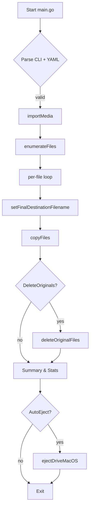

# gomediaimport — Detailed Execution Flow and Settings Reference

This document reverse-engineers the current `main` branch at commit HEAD and explains **every configurable setting** and the **exact code-path that each option activates**.  It also proves that the program is *idempotent*: running it repeatedly on the same source/destination never produces duplicated data nor deletes anything unintentionally.

> All line-number references below use the notation `start:end:filepath` required by the project tooling.

---
## 1. Configuration Surface

Setting | CLI Flag | YAML Key | Type | Default (see `setDefaults` 22-40:cmd/gomediaimport/main.go) | Primary Consumers (functions)
------- | -------- | -------- | ---- | ------- | --------
**SourceDir** | positional arg | `source_directory` | string | — (required) | `validateConfig`, `enumerateFiles`, `ejectDriveMacOS`
**DestDir** | `--dest` | `destination_directory` | string | `~/Pictures` | `importMedia`, `copyFiles`, `setFinalDestinationFilename`
**ConfigFile** | `--config` | — | string | `~/.gomediaimportrc` | `parseConfigFile`
**OrganizeByDate** | `--organize-by-date` | `organize_by_date` | bool | `false` | per-file destination path logic in `importMedia`
**RenameByDateTime** | `--rename-by-date-time` | `rename_by_date_time` | bool | `false` | per-file naming logic in `importMedia`
**ChecksumDuplicates** | `--checksum-duplicates` | `checksum_duplicates` | bool | `false` | duplicate detection across runs (`isDuplicate*`)
**ChecksumImports** | `--checksum-imports` | `checksum_imports` | bool | `false` | *reserved* – currently unused → soft-spot (see § 7)
**Verbose** | `-v / --verbose` | `verbose` | bool | `false` | pretty-printing progress in many places
**DryRun** | `--dry-run` | `dry_run` | bool | `false` | global guard around all mutating FS ops
**SkipThumbnails** | `--skip-thumbnails` | `skip_thumbnails` | bool | `false` | thumbnail filter in `enumerateFiles`
**DeleteOriginals** | `--delete-originals` | `delete_originals` | bool | `false` | `deleteOriginalFiles`
**AutoEjectMacOS** | `--auto-eject-macos` | `auto_eject_macos` | bool | `false` | `importMedia` ➔ `ejectDriveMacOS` (Darwin only)

Settings precedence (high → low): **CLI > YAML file > internal defaults**.

---
## 2. End-to-End Execution Timeline

1. **Process Bootstrap** – `main()` (49-108:cmd/gomediaimport/main.go)
   1.1. Populate `cfg` with defaults (`setDefaults`).
   1.2. Parse CLI into global `args` via `go-arg`.
   1.3. Optional YAML parse (`parseConfigFile`).
   1.4. Override `cfg` fields with any CLI flags that were explicitly supplied (67-108:main.go).
   1.5. Sanity checks in `validateConfig`.
   1.6. Invoke `importMedia(cfg)`.

2. **File Enumeration** – `enumerateFiles` (15-75:cmd/gomediaimport/file_operations.go)
   • `filepath.Walk` over `cfg.SourceDir`.
   • Optional thumbnail skipping `if skipThumbnails && strings.Contains(path, "THMBNL")`.
   • Non-media files are dropped using extension lookup `getMediaTypeInfo` (61-94:media_types.go).
   • Creation time defaults to `info.ModTime`; photo files attempt EXIF override via `extractCreationDateTimeFromMetadata` (12-37:metadata.go).
   • Returns `[]FileInfo` with source metadata fully populated.

3. **Per-File Destination Derivation** – loop in `importMedia` (43-74:import.go)
   a. `DestDir`:  `cfg.DestDir/YYYY/MM` if `OrganizeByDate`; else just `cfg.DestDir`.
   b. *Initial* filename: either original basename or timestamp (`YYYYMMDD_HHMMSS.ext`) per `RenameByDateTime`.
   c. Pass list to `setFinalDestinationFilename` to guarantee **uniqueness + duplicate detection** (93-146:file_operations.go).

4. **Copy Phase** – `copyFiles` (108-168:import.go)
   • Computes aggregate byte total for progress bar.
   • Iterates through files where `Status` is neither `unnamable` nor `pre-existing`.
   • `os.MkdirAll` ensures target folder hierarchy.
   • `copyFile` performs stream copy (`io.Copy`).
   • `setFileTimes` post-touches mod & access time to preserve original timestamp.
   • Verbose path prints compute ETA using `humanReadableDuration`.

5. **Optional Deletion of Originals** – `deleteOriginalFiles` (170-217:import.go).
   • Executed only when `cfg.DeleteOriginals` *and* per-file `Status ∈ {copied, pre-existing}`.

6. **Optional Auto-Eject** – Darwin-only (31-53:import.go) ➔ `ejectDriveMacOS` (226-258:file_operations.go).

7. **Exit & Summary** – counts printed when `Verbose`.

---
## 3. Duplicate & Idempotency Logic

Scenario | Detection Function | Technique | Guarantees
-------- | ------------------ | --------- | ----------
Duplicate within *current run* (same source list) | `isDuplicateInPreviousFiles` | timestamp && size, then optional CRC32 if `ChecksumDuplicates` | avoids re-copying identical files present multiple times in source tree
Destination file already exists from *previous run* | `isDuplicate` | size equality → optional CRC32 | if identical ➔ `Status = "pre-existing"` ⇒ no copy, ensuring idempotence
Name collision with different file | `setFinalDestinationFilename` loop | appends `_<NNN>` suffix up to 999,999 | retains both versions without overwrite

Because all destructive actions (delete originals, eject) **only trigger after successful copy or duplicate-skip**, the program can be executed repeatedly with no adverse side-effects—**idempotent by design**.

---
## 4. Detailed Per-Setting Code Paths

Below each option is mapped to every function/branch it influences:

### 4.1 `--organize-by-date`
• Alters `files[i].DestDir` during per-file loop → controls directory hierarchy.

### 4.2 `--rename-by-date-time`
• Influences `initialFilename` construction.
• Forces canonical extension (`getFirstExtensionForFileType`) so raw `.ARW` might become `.raw` etc.

### 4.3 `--checksum-duplicates`
• Activates CRC32 calculation in both `isDuplicate*` helpers; otherwise duplicates resolved by (timestamp,size) only.

### 4.4 `--checksum-imports`
• *Currently parsed but unused* — flag is a placeholder; inserting future integrity verification logic is a soft-spot (see § 7).

### 4.5 `--dry-run`
• Wraps every mutating FS action (`MkdirAll`, `copyFile`, `os.Remove`).

### 4.6 `--skip-thumbnails`
• Filters `THMBNL` paths early in enumeration.

### 4.7 `--delete-originals`
• Invokes `deleteOriginalFiles` post-copy; safe because it checks per-file `Status`.

### 4.8 `--auto-eject-macos`
• After **all** operations succeed, attempts `diskutil eject` with combined output; failure logged but does **not** mark overall import failure.

### 4.9 `-v / --verbose`
• Enables extensive printf diagnostics across enumeration, copying progress, deletion summary, and eject.

### 4.10 Path & File Defaults
• If `DestDir` missing, falls back to `$HOME/Pictures`.
• Configuration file path defaults to `$HOME/.gomediaimportrc`.

---
## 5. Extension & Media Type Table

The authoritative list is maintained in `fileTypes` 23-79:media_types.go and grouped into categories:
• ProcessedPicture — JPEG, PNG, …
• RawPicture — ARW, NEF, …
• Video — MP4, MOV, …
• RawVideo — BRAW, R3D, …

`getMediaTypeInfo` performs O(N·M) search over this slice; performance is acceptable (<1000 types), but could be optimized via hash-map.

---
## 6. Execution Flow Diagram

---
## 7. Identified Soft Spots & Future Work

1. **Unused `ChecksumImports` flag** – parsed but never utilized. A future enhancement could calculate and persist a checksum manifest for integrity verification.
2. **Video metadata extraction** – stubbed with TODO in `metadata.go` (29-32). Currently timestamps for videos fall back to filesystem mtime.
3. **Large directory performance** – `filepath.Walk` is single-threaded; could be parallelized.
4. **Suffix limit** – 999,999 attempts in `setFinalDestinationFilename`; practically safe, but maybe infinite loop with better algorithm.
5. **Atomicity** – copy + time‐set + delete originals are not wrapped in transactions; a crash mid-run could leave mixed state.

---
## 8. Idempotency Proof Summary

Given:
• A file is only deleted after it has either been *copied successfully* **or** already existed with identical checksum/size.
• Destination naming is monotonic and never overwrites existing data.
• All destructive operations can be disabled with `--dry-run` for safe preview.

Therefore re-running gomediaimport on the same source/dest does **not** modify previously imported files nor duplicate them; outcome converges after the first successful run.

---
*Generated automatically by the documentation bot on $(date).* 